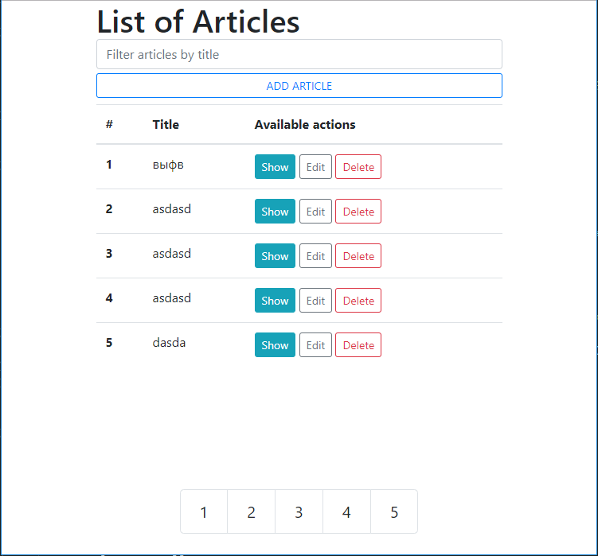
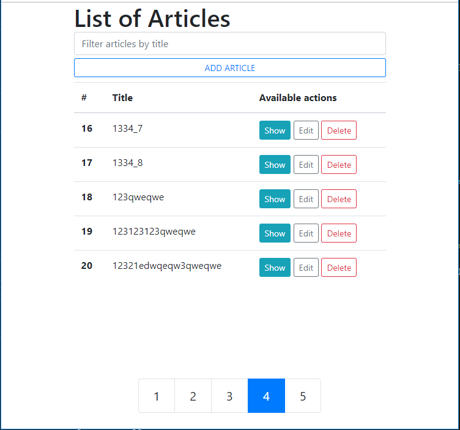
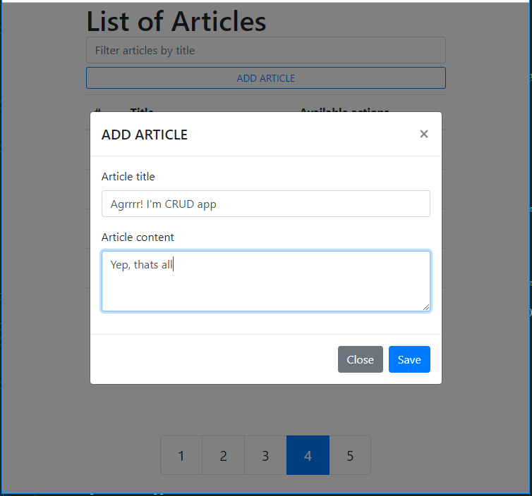
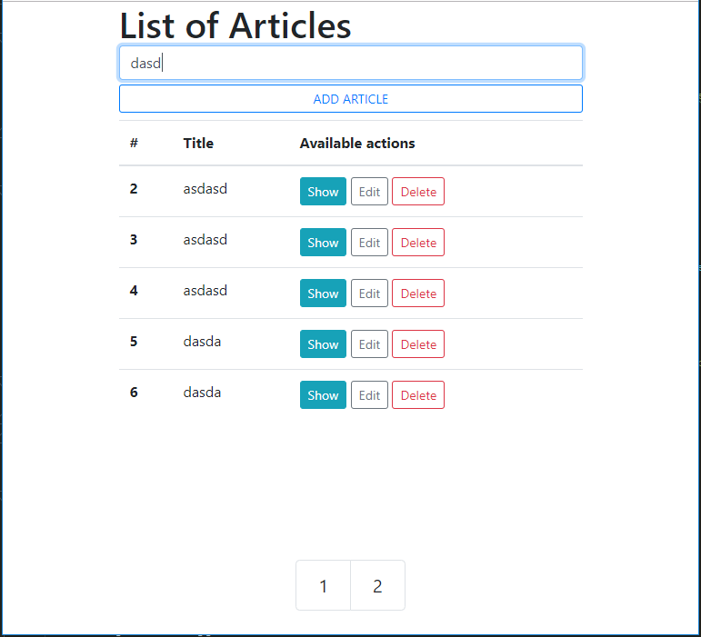

# CRUD App: Vue.js & FastAPI
Template project for CRUD App using Vue.js and FastAPI

App configs `settings.py`:
```python
PAGE_SIZE = 5

STATIC_URL = '/static/'
STATIC_DIRECTORY = 'static'

TEMPLATE_DIRECTORY = 'templates'
BASE_TEMPLATE_NAME = 'index.html'

DATABASE_URL = "sqlite:///./db.sqlite3"

ALLOWED_HOSTS = ['*']
# ALLOWED_HOSTS = []  # for development
# ALLOWED_HOSTS = ['*']  # for docker-compose
# ALLOWED_HOSTS = ["your-production-domain"]  # for production
```

Fill your database and run FastAPI development server:
```
$ pip3 install -r requirements.txt
$ uvicorn main:app --reload
```

To run with a docker compose:
```
$ docker-compose up
```

## Screens
##### Example #1: Main page

##### Example #2: Pagination

##### Example #3: Create article

##### Example #4: Search article by title

